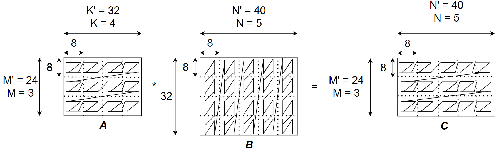

# Integer GEMM Accelerator for SNAX

This repository contains the RTL to build an 8-bit integer GEMM (General Matrix Multiply) accelerator
to integrate into the [SNAX core](https://github.com/KULeuven-micas/snitch_cluster). This repository contains the chisel sources and unit tests for the GEMM accelerator.
It is written in CHISEL 5.0.0 and connected to the SNAX accelerator RISC-V manager core through SystemVerilog.

## Microarchitecture

The microarchitecture of the GEMM accelerator is shown below. The GEMM array has meshRow row and meshCol column tiles. Each tile implements a tileSize vector dot product.


## Functional description

This repository contains three GEMM versions: Base GEMM, Block GEMM, and Batch Stride GEMM.

### Base GEMM

Base GEMM implements General Matrix Multiply: C = (A -a) * (B - b), where a and b are scalar values. Base GEMM is parameterized and its parameters are listed below. These parameters can be configured in the `main/scala/gemm/Parameter.scala` file.
| Parameter | Meaning |
| - | -|
| dataWidthA | Input matrix data width (integer) |
| dataWidthC | Output matrix data width (integer) |
| dataWidthAccum | Accumulator data width (integer) |
| meshRow | The row number of the GEMM array |
| meshCol | The column number of the GEMM array |
| tileSize | The tile size of each tile |

The size of matrix A is (meshRow, tileSize) and the size of matrix B is (tileSize, meshCol). The size of result matrix C is (meshRow, meshCol). To get the right results, matrix A should be arranged in `row-major order` and matrix B should be arranged in `column-major order`. The result matrix C is arranged in `row-major order` by Base Gemm. The data layout of the three matrices is shown below. The data in each small block indicates the address. How the address increases shows the data arrangement in memory.


Each row of the GEMM array takes in the corresponding row of matrix A, i.e., all the tiles in the ith row take in the ith row of matrix A. And each column of the GEMM array takes in the corresponding column of matrix B, i.e., all the tiles in the jth column take in the jth column of matrix B. This process is shown in the figure below in detail.


The base GEMM also has an accumulation option. If the signal `accumulate` is one, then the accumulator register will retain it's current result. If the signal `accumulate` is zero, then the accumulator register will clear itself.
This option is useful for using the base GEMM for software-managed block matrix multiplication.

The Base GEMM function definition pseudocode is shown below.

```
bool gemm(int8_t *A, int8_t *B, int32_t * C, bool accumulate)
```

### Block GEMM

The Block GEMM is built with the Base GEMM.
The GEMM accelerator uses the [Block matrix multiplication method](https://en.wikipedia.org/wiki/Block_matrix#Block_matrix_multiplication) to implement matrix multiplication in which the matrix sizes are larger than the physical GEMM array.

It takes in the M, K, and N configurations as the size of the block gemm.
In this case, the size of matrix A is (`M' = M * meshRow`, `K' = K * tileSize`) and the size of matrix B is (`K' = K * tileSize`, `N' = N * meshCol`). The size of result matrix C is (`M' = M * meshRow, N' = N * meshCol`) as shown below.


#### Computation analysis

Take a Block Gemm with hardware parameters: `meshRow == tileSize == meshCol == 8` as an example, the `M, K, and N` should be configured as `4, 2, and 3` respectively if we want to do the block matrix multiplication with `C(32,24) = A(32,16) * B(16,24), M’ = 32, K’ = 16, N’ = 24`. The block matrix multiplication is illustrated in the picture below. With:

* M<sub>u</sub> (M unrolling) = meshRow = 8
* K<sub>u</sub> (K unrolling) = tileSize = 8
* N<sub>u</sub> (N unrolling) = meshCol = 8


The pseudocode is :

```
for (m1 = 0 to M’/Mu - 1); 
for (n1 = 0 to N’/Nu - 1); 
for (k1 = 0 to K’/Ku - 1); 
  parallel_for(m2 = 0 to Mu)
  parallel_for(n2 = 0 to Nu)
  parallel_for(k2 = 0 to Ku)
  o[m1*Mu+m2][n1*Nu+n2] += (i[m1*Mu+m2][k1*Ku+k2] - a) * (w[k1*Ku+k2][n1*Nu+n2] - b);
```

#### Data layout

To get the right results, the input matrices should have the right layout in memory. The address of matrix A, B, and C should also be given when configuring the Block Gemm. In the current version, the data of A and B should be stored in memory with a stride of 1.

Take a Block Gemm with hardware parameters: `meshRow == tileSize == meshCol == 8` as an example, the `M, K, and N` should be configured as `3, 4, and 5` respectively if we want to do the block matrix multiplication with `C(24,40) = A(24,32) * B(32,40), M’ = 24, K’ = 32, N’ = 40` as shown in below.


To get the right results for `M = 3`, `K=4` and `N=5` , the matrix A should be arranged as M<sub>3</sub> K<sub>4</sub> M<sub>8</sub> K<sub>8</sub>. B should be arranged as N<sub>5</sub> K<sub>4</sub> N<sub>8</sub> K<sub>8</sub>. C should be arranged as M<sub>3</sub> N<sub>5</sub> M<sub>8</sub> N<sub>8</sub>. Take matrix A for example, the innermost is 8 elements in the K dimension, then is the 8 rows in the M dimension, then is 4 big columns in the K dimension, and the outermost is 3 big rows in the M dimension.



To illustrate it more for clarification, another example is for Block Gemm with hardware parameters: `meshRow == tileSize == meshCol == 2` and with a block matrix multiplication for  `M = 2, K = 2, and N = 2`. The two figures below illustrate the detailed data layout in memory. The continuous liens in the first picture are the conceptual addresses in memory. The concrete layout in memory for each element is shown in the second picture.


#### Programming model

The Block GEMM function c wrapper pseudocode is shown below.

```
bool blockGemm(int M, int K, int N, int8_t *A, int8_t *B, int32_t * C)
```

#### Ports

| Signals | Signal name in generated SV | Width | Dir | Description |
| - | - | - | - | - |
| M_i | i_io_ctrl_M_i | 8 | In | The M size setting |
| K_i | i_io_ctrl_K_i | 8 | In | The K size setting |
| N_i | i_io_ctrl_N_i | 8 | In | The N size setting |
| ptr_addr_a_i | io_ctrl_ptr_addr_a_i | 32 | In | The address of the matrix A. It points to the first data element of matrix A.|
| ptr_addr_b_i | io_ctrl_ptr_addr_b_i | 32 | In | The address of the matrix B. It points to the first data element of matrix B.|
| ptr_addr_c_i | io_ctrl_ptr_addr_c_i | 32 | In | The address of the matrix C. It points to the first data element of matrix C.|
| start_do_i | io_ctrl_start_do_i | 1 | In |  Start do signal. When this `start_do_i` signal asserts, all the configuration signals (M_i, K_i, N_i, ptr_addr_a_i, ptr_addr_b_i and ptr_addr_c_i) should be ready|
| data_valid_i | io_ctrl_data_valid_i | 1 | In | Input data valid signal|
| addr_a_o | io_ctrl_addr_a_o | 32 | Out | The address of the sub-matrix of A. It points to the first data element of the sub-matrix of A. |
| addr_b_o | io_ctrl_addr_b_o | 32 | Out | The address of the sub-matrix of B. It points to the first data element of the sub-matrix of B |
| addr_c_o | io_ctrl_addr_c_o | 32 | Out | The address of the sub-matrix of C. It points to the first data element of the sub-matrix of C. |
| busy_o | io_ctrl_busy_o | 1 | Out | Indicating if Block Gemm is busy. When `busy_o` is asserted, the Block Gemm doesn't take in any new `start_do_i` signal or configuration.|
| a_i | io_data_a_i | meshRow *tileSize* input | In | A big bus containing all the data elements of the input (sub-)matrix A |
| b_i | io_data_b_i | tileSize *meshCol* input | In | A big bus containing all the data elements of the input (sub-)matrix B |
| c_o | io_data_c_o | meshRow *meshCol* output | Out | A big bus containing all the data elements of the input (sub-)matrix C |
| subtraction_a_i | io_ctrl_subtraction_a_i | 8 | In | The scalar value for A to subtract|
| subtraction_b_i | io_ctrl_subtraction_b_i | 8 | In | The scalar value for B to subtract|

### Batch Stride GEMM

The Batch Stride GEMM is built with the Block GEMM. Basically, the Batch Stride GEMM does multiple block matrix multiplication. The pseudocode is:

```
for (batch = 0; batch < Batch; batch++) {
  C[batch] = (A[batch] - a) * (B[batch]- b) // Each is a blockGemm
}
```

Besides M, K and N, it takes in an extra Batch configuration (B). It also takes in nine extra strides configuration, eg., strideInnermostA, strideInnermostB, strideInnermostC, ldA, ldB, ldC, strideA, strideB, and strideC, for computing the address for each sub-matrix in the block matrix multiplication and the start matrix for each batch.

The illustration of strideInnermostA, strideInnermostB, strideInnermostC, ldA, ldB, ldC, strideA, strideB, and strideC is listed below.

| Stride configuration | Meaning |
| - | -|
| strideInnermostA | the incremental address for a new submatrix of each block row of A|
| strideInnermostB | the incremental address for a new submatrix of each block column of B|
| strideInnermostC | the incremental address for a new submatrix of each block row of C|
| ldA | the incremental address for a new block row of A |
| ldB | the incremental address for a new block column of B |
| ldC | the incremental address for a new block row of C |
|strideA | the incremental address of matrix A for each batch |
|strideB | the incremental address of matrix B for each batch |
|strideC | the incremental address of matrix C for each batch |

#### Computation analysis


Batch Stride GEMM does Batch number of the same size Block Gemm.
The computation flow is shown as the following picture.


The pseudocode is :


```

for (b = 0; b < B; b++) {
  for (i = 0; i < M; i++) {
    for (j = 0; j < N; j++) {
      for (k = 0; k < K; k++) {
        addr_a = start_addr_a + b *strideA + m* ldA + k *strideInnermostA
        addr_b = start_addr_b + b* strideB + n *ldB + k* strideInnermostB
        addr_c = start_addr_c + b *strideC + m* ldC + n * strideInnermostC
        C[addr_c] = baseGemm(addr_a,addr_b)
      }
    }
  }
}

```

To better illustrate the meaning of the strideInnermostA, strideInnermostB, strideInnermostC, ldA, ldB, ldC, strideA, strideB, and strideC, an address table with an auxiliary picture is shown below.


| Computation process| Address of submatrix of A generation using strides | Address of submatrix of A generation using strides | Address of submatrix of A generation using strides |
| - | - | - | - |
| b=0, m=0, k=0, n=0 | start address of A11  | start address of B11  |  start address of C11 |
| b=0, m=0, k=1, n=0 | start address of A12 (ptr_addr_a_i + k * strideInnermostA)  | start address of B21 (ptr_addr_b_i + k * strideInnermostB)   |  start address of C11 |
| b=0, m=0, k=0, n=1 | start address of A11  | start address of B12 (ptr_addr_b_i + ldB, ldB = the incremental address for a new block column of B) |  start address of C12  (ptr_addr_c_i + n * strideInnermostC) |
| b=0, m=0, k=1, n=1 | start address of A12(ptr_addr_a_i + k * strideInnermostA)  | start address of B12 (ptr_addr_b_i + ldB + strideInnermostB) |  start address of C12  (ptr_addr_c_i + n * strideInnermostC) |
| ... | ... | ... | ... |
| b=1, m=0, k=0, n=0 | start address of A11' for batch 1 (ptr_addr_a_i + stride_A, stride_A = the incremental address of matrix A for each batch) | start address of B11' for batch 1 (ptr_addr_b_i + stride_B, stride_B = the incremental address of matrix B for each batch) |  start address of C11' for batch 1 (ptr_addr_c_i + stride_C, stride_C = the incremental address of matrix C for each batch)|
| ... | ... | ... | ... |

#### Data layout


The data layout of Batch Stride GEMM is the same as Block GEMM except for there is another outmost dimension which is B.

#### Programming model


```

<T>gemmStridedBatched(
int Batch, int M, int N, int K,
const T*A, int strideInnermostA, int ldA, int strideA,
const T* B, int strideInnermostB, int ldB, int strideB,
const T* C, int strideInnermostC, int ldC, int strideC,
)

```

#### Ports


Except the ports already listed in Block GEMM, Batch Stride GEMM has some extra ports which is listed below.

| Signals | Signal name in generated SV | Width | Dir | Description |
| - | - | - | - | - |
| B_i | io_ctrl_B_i | 8 | In | The Batch size setting |
| strideInnermostA_i | io_ctrl_strideInnermostA_i | 32 | In | the address stride for a new submatrix of each block row of A |
| strideInnermostB_i | io_ctrl_strideInnermostB_i | 32 | In |  the address stride for a new submatrix of each block column of B |
| strideInnermostC_i | io_ctrl_strideInnermostC_i | 32 | In |  the address stride for a new submatrix of each block row of C |
| ldA_i | io_ctrl_ldA_i | 32 | In |  the address stride for a new block row of matrix A |
| ldB_i | io_ctrl_ldB_i | 32 | In |  the address stride for a new block column of matrix B |
| ldC_i | io_ctrl_ldC_i | 32 | In |  the address stride for a new block row of matrix C |
| strideA_i | io_ctrl_strideA_i | 32 | In |  the address stride for matrix A in different batch|
| strideB_i | io_ctrl_strideB_i | 32 | In |  the address stride for matrix B in different batch|
| strideC_i | io_ctrl_strideC_i | 32 | In |  the address stride for matrix C in different batch|

### Batch Stride GEMM with multi-cycle output


This module adds support for 8, 16 32 TCDM ports with 64 bits width for each TCDM ports. There is no functionality difference from software side.
In hardware, the Gemm will stall the input and the computation until the output is finished.

#### Ports


Besides the ports already in Batch Stride GEMM, this module add another multi cycle output port.
| Signals | Signal name in generated SV | Width | Dir | Description |
| - | - | - | - | - |
| multi_stage_c_o | io_data_multi_stage_c_o | TCDMWritePorts * GemmConstant.TCDMDataWidth | Out | multi cycle output port |

## SNAX Wrapper

This wrapper module connect the GEMM Accelerator with [SNAX](<https://github.com/KULeuven-micas/snitch_cluster>) platform. It has two data register to temporarily store input data for GEMM Accelerator when the TCDM memory is not ready because of the data contention.

### Interface with SNAX

| Signals            | Width              | Direction | Description                        |
|--------------------|--------------------|-----------|------------------------------------|
| clk_i              | 1                  | Input     | Clock signal                       |
| rst_ni             | 1                  | Input     | Reset signal, low valid            |
| snax_qvalid_i     | 1                  | Input     | Input valid signal for SNAX accelerator CSR write(configuration) / read   port  |
| snax_qready_o     | 1                  | Output    | Output ready signal for SNAX accelerator CSR write(configuration) / read   port     |
| snax_req_i        | acc_req_t(decided by SNAX parameters)          | Input     | SNAX accelerator CSR write(configuration) / read   port      |
| snax_resp_o       | acc_rsp_t(decided by SNAX parameters)          | Output    | Output response signal for SNAX  CSR read  |
| snax_pvalid_o     | 1                  | Output    | Output valid signal for SNAX  CSR read      |
| snax_pready_i     | 1                  | Input     | Input ready signal for SNAX  CSR read       |
| snax_tcdm_req_o   | tcdm_req_t[SnaxTcdmPorts-1:0](decided by SNAX parameters) | Output    | Output request signal for tcdm     |
| snax_tcdm_rsp_i   | tcdm_rsp_t[SnaxTcdmPorts-1:0](decided by SNAX parameters) | Input     | Input response signal for tcdm     |

More detailed illustration about the interface between SNAX and GEMM Accelerator can be found at SNAX platform. For acc_req_t and acc_rsp_t, please refer to [reqrsp_interface](<https://github.com/KULeuven-MICAS/snitch_cluster/blob/main/hw/reqrsp_interface/include/reqrsp_interface/typedef.svh>). For tcdm_req_t and tcdm_rsp_t, please refer to [mem_interface
](<https://github.com/KULeuven-MICAS/snitch_cluster/blob/main/hw/mem_interface/include/mem_interface/typedef.svh>).

### CSR definition

| Address | CSR name             | Notes                               |
|---------|----------------------|-------------------------------------|
| 0x3c0   | MatrixSizeCsr        | Matrix size configuration, MatrixSizeCsr[31:24] = Batch, MatrixSizeCsr[23:16] = M, MatrixSizeCsr[15:8] = K MatrixSizeCsr[7:0] = N            |
| 0x3c1   | AddrACsr             | Start address of matrix A           |
| 0x3c2   | AddrBCsr             | Start address of matrix B           |
| 0x3c3   | AddrCCsr             | Start address of matrix C           |
| 0x3c4   | StrideInnermostACsr  | The incremental address for a new submatrix of each block row of A   |
| 0x3c5   | StrideInnermostBCsr  | The incremental address for a new submatrix of each block row of B   |
| 0x3c6   | StrideInnermostCCsr  | The incremental address for a new submatrix of each block row of C   |
| 0x3c7   | LdACsr               | The incremental address for a new block row of A             |
| 0x3c8   | LdBCsr               | The incremental address for a new block column of B             |
| 0x3c9   | LdCCsr               | The incremental address for a new block column of C             |
| 0x3ca   | StrideACsr           | The incremental address of matrix A for each batch         |
| 0x3cb   | StrideBCsr           | The incremental address of matrix B for each batch         |
| 0x3cc   | StrideCCsr           | The incremental address of matrix C for each batch          |
| 0x3cd   | PerfCounterCsr       | Performance counter for GEMM busy cycles |
| 0x3ce   | SubtractionCsr       | The two subtraction value, SubtractionCsr[7:0] = a, SubtractionCsr[15:8] = b |
| 0x3cf   | StateCsr             | State CSR indicating GEMM start and busy status  |

## Unit test

This repository also contains some unit tests for each version of GEMM.
The unit tests are also written in Chisel. Firstly, random input matrices and random size configurations are generated.
Then these matrices and configurations are fed into the GEMM accelerator.
After the computation, the output result of the GEMM accelerator will be compared with the golden model in Scala.

There is also a corner case test for Block Gemm and Batch Stride Gemm to see if the Block Gemm and Batch Stride Gemm works well in extreme configurations, such as `M == K == N == 1` for Block Gemm.

In the current unit test, we only test the GEMM with input datatype as int8 and output data type as int32. The GEMM array size is also fixed.

## Quickstart


Follow this quickstart to set up the Chisel environment and run the unit tests of the GEMM accelerator.


### Set up Chisel environment

Run following script:

```

./install.sh

```

## Run tests


To run all the Gemm accelerator tests, use:


```

sbt test

```

To run specific test, use:


```

sbt "testOnly gemm.${chisel_test_name}"

```


where `chisel_test_name` is the class name of the specific test. For instance, use:


```

sbt "testOnly gemm.GemmArrayRandomTest"

```


to only run the random data and random matrix size test for Base Gemm.

Note: run the test for the Chisel module also generate the corresponding system verilog file to test if the system verilog file can be generated correctly.

## Generate System Verilog file


To generate the corresponding system verilog file for specific Chisel module, use:


```

sbt "runMain gemm.${chisel_module_name}"

```

For instance, to generate the system verilog file for Base Gemm, use:

```

sbt "runMain gemm.GemmArray"

```

## Acknowledgement

We learned a lot from [Huawei DaVinci](https://ieeexplore.ieee.org/document/9407221) when developing the Gemm Accelerator.
